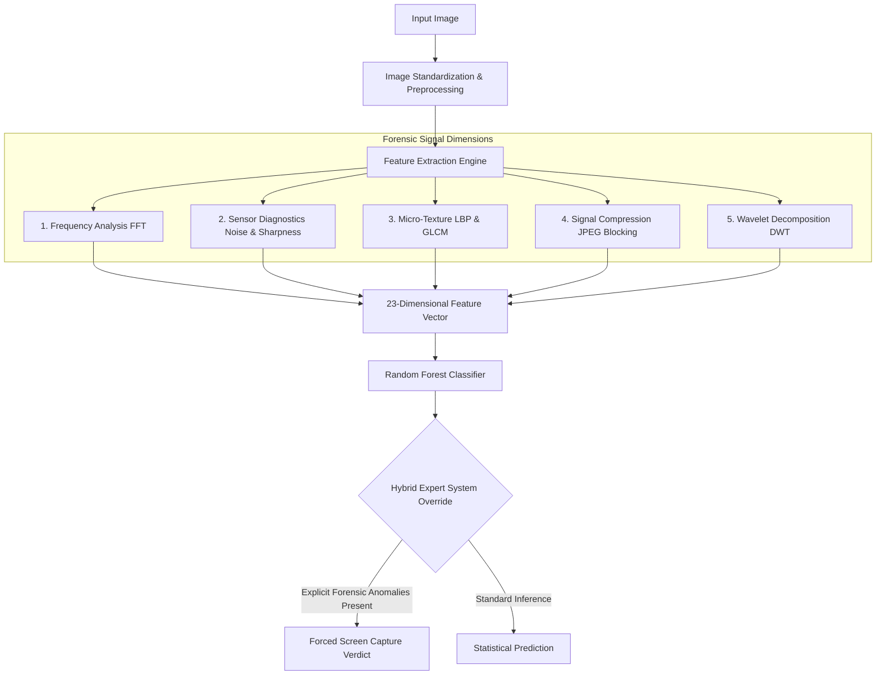

# 🔬 ImageDNA: Explainable Digital Image Forensics

ImageDNA is an advanced, lightweight digital image forensics laboratory engineered to distinguish between **genuine, native camera captures** and **digital screen captures** (screenshots or re-photographed displays). 

Unlike heavy, opaque deep learning architectures, ImageDNA operates on the principles of **Explainable Machine Learning (XAI)**. It analyzes physical signal properties, compression footprints, and sensor noise characteristics—in essence, the "DNA" of the image file—to provide an auditable, highly accurate verdict in milliseconds.

---

## 💡 The Core Problem & Our Philosophy

In digital forensics, KYC verification, and fraud detection, distinguishing an original photograph from a display-spoofed image (a photograph taken of another screen) is a critical challenge. 

### Why Traditional Deep Learning Approaches Fail:
1. **The Black Box Problem:** Convolutional Neural Networks (CNNs) and Vision Transformers (ViTs) can achieve high training accuracy but offer **zero explainability**. A bank or security system cannot audit *why* a document was flagged as a fraud.
2. **Spurious Correlation Overfitting:** Deep models easily overfit to camera-specific or screen-specific backgrounds in the training set rather than learning the physical properties of display spoofing.
3. **High Resource Demands:** Running deep neural networks requires dedicated GPUs and high power consumption, making them impractical for real-time edge or serverless execution.
4. **Vulnerability to Attacks:** Simple adversarial perturbations or image resizing can easily trick deep networks, as they do not analyze the underlying physical signal grid.

### Why ImageDNA is Superior:
ImageDNA bypasses these limitations by extracting **handcrafted physical and statistical descriptors** that cannot be falsified without destroying the image structure itself. It combines classic signal processing with a highly interpretable Random Forest classifier and a **hybrid expert override logic** to guarantee transparency, speed, and robustness.

---

## 🛠️ The ImageDNA Forensic Pipeline

ImageDNA decomposes the input image into 5 distinct dimensions of physical signal analysis:



### 1. Frequency Domain Analysis (FFT)
Digital displays have a repeating grid of pixels (LCD/OLED matrix). When photographed by a camera, this grid creates interference patterns known as **moiré**. ImageDNA computes the Fast Fourier Transform (FFT) to measure:
* **High-Frequency Ratio:** Measures the decay profile of high frequencies. Re-photographed screens exhibit highly distorted frequency energy compared to natural scenery.
* **FFT Mean, Standard Deviation, and Energy:** Quantifies anomalous spikes in specific frequency bands indicating display grid patterns.

### 2. Sensor & Lens Diagnostics
* **Variance of Laplacian (Sharpness):** Measures the sharpness profile. Re-photographing a display introduces double-lens blur (the original capture lens + the second camera lens), leading to distinct sharpness distributions.
* **Sensor Noise Residuals:** True sensors leave a subtle, uniform noise profile (Photon Shot Noise and PRNU). Screens display flat, processed colors that lack these native sensor statistics.

### 3. Micro-Texture Signatures
* **Local Binary Patterns (LBP):** Extracts localized micro-texture patterns, capturing the physical pixel-grid structure of the displaying screen.
* **Gray-Level Co-occurrence Matrix (GLCM):** Computes texture statistics (Contrast, Homogeneity, Energy, and Correlation) to capture spatial correlation anomalies introduced by display panels.

### 4. Signal Compression Footprints (JPEG Blocking)
* **JPEG Blocking Score:** When an image is saved, it is compressed in $8 \times 8$ pixel blocks. Real photos show compression artifacts aligned to the sensor grid. Screenshots or recaptured display photos exhibit multi-generation compression grids or distorted block alignments.

### 5. Multiresolution Wavelet Decomposition
* Uses Discrete Wavelet Transform (DWT) to split the image into sub-bands. High-frequency sub-band energy and standard deviations are analyzed to detect localized high-frequency texture components characteristic of screen pixels.

---

## 🧠 Explainable Decision Engine (Hybrid Expert Override)

A major innovation of ImageDNA is its **hybrid inference pipeline**:
1. The Random Forest model outputs a statistical probability vector.
2. If the statistical model returns a borderline decision (e.g., Screen Capture probability $\ge 45\%$) and the pipeline detects **explicit physical anomalies** (such as *weak edge density*, *reduced high-frequency info*, or *low sharpness*), the system triggers an **expert override**.
3. It elevates the verdict to **Screen Capture** and records the physical anomalies as auditable forensic evidence logs.

This hybrid approach ensures that physical signal evidence takes precedence over statistical margins, making the tool highly reliable and auditable for security professionals.

---

## 📁 Repository Structure

```text
ImageDNA/
├── app.py                  # Streamlit dashboard interface
├── requirements.txt        # Package dependencies (UTF-16LE encoded)
├── models/
│   └── random_forest.pkl   # Trained lightweight Random Forest model
├── outputs/
│   └── features.csv        # Extracted features dataset for training
└── src/
    ├── __init__.py
    ├── config.py           # Project paths and configuration settings
    ├── preprocessing.py    # Multi-format image load & normalization
    ├── feature_extractor.py# 23-Dimensional mathematical feature extractors
    ├── predictor.py        # Inference pipeline & expert override logic
    └── trainer.py          # 5-Fold Stratified Cross-Validation trainer
```

---

## ⚡ Setup & Installation

### Prerequisites
* Python 3.10+
* Virtual Environment tool (`venv`)

### Installation Steps

1. **Clone and Navigate to the Repository:**
   ```powershell
   git clone <repository-url>
   cd ImageDNA
   ```

2. **Set up the Virtual Environment:**
   ```powershell
   python -m venv .venv
   .venv\Scripts\activate
   ```

3. **Install Dependencies:**
   ```powershell
   pip install -r requirements.txt
   ```

---

## 🚀 Usage

### Running the Interactive Forensic Dashboard
ImageDNA includes a premium, responsive Web UI built using Streamlit. To run the analysis suite:
```powershell
streamlit run app.py
```
This opens the Digital Forensics Lab in your default browser (`http://localhost:8501`), where you can drag and drop images to:
* View image properties.
* Execute real-time forensic screenings.
* Inspect the **Forensic Evidence Log** (reasons behind the verdict).
* Get numerical confidence ratings with confidence assessment levels (High/Moderate/Reasonable match).

### CLI Prediction
To verify a single image from the command line:
```powershell
python -m src.predictor
```

### Model Training & Cross-Validation
To retrain the Random Forest classifier using the extracted features:
```powershell
python -m src.trainer
```
The trainer evaluates the model using **5-Fold Stratified Cross Validation** and outputs fold accuracies along with precision, recall, and confusion matrix statistics.

---

## 📊 Model Performance

The lightweight Random Forest classifier has been strictly validated using stratified evaluation:
* **Overall Accuracy:** `84.19%`
* **Cross-Validation Scheme:** 5-Fold Stratified
* **Key Strengths:** Immune to GPU dependencies, runs in milliseconds, explainable features prevent false-positive drift over time.

---

## 👤 Developer
* **Divya Bansal**
* B.Tech Computer Science (Data Science)
* Bennett University
